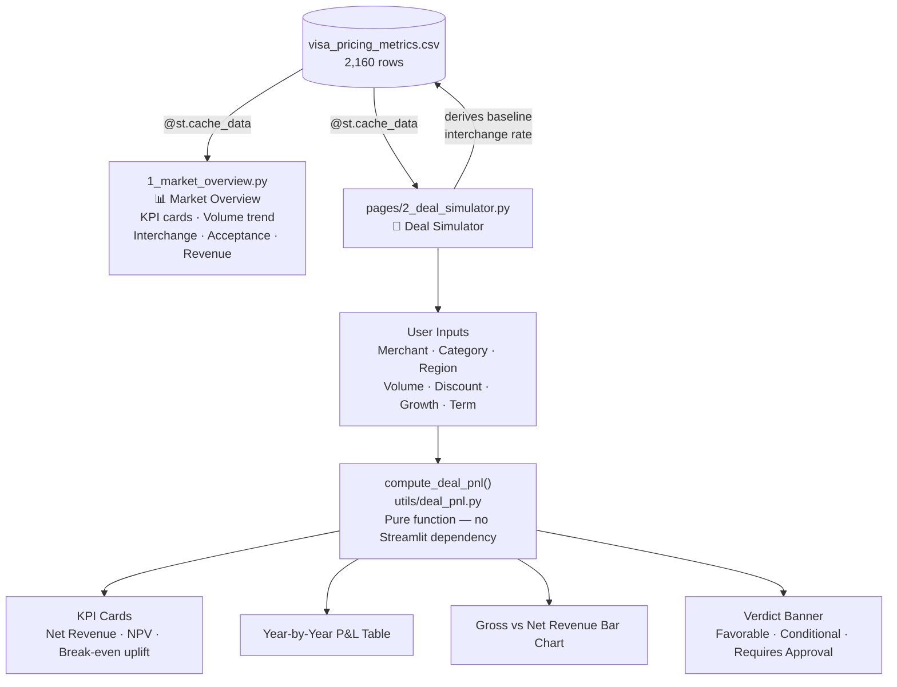

# Pipeline Diagram

```mermaid
flowchart TD
    CSV[("visa_pricing_metrics.csv\n2,160 rows")]

    CSV -->|"@st.cache_data"| P1["1_market_overview.py\n📊 Market Overview\nKPI cards · Volume trend\nInterchange · Acceptance · Revenue"]
    CSV -->|"@st.cache_data"| P2["pages/2_deal_simulator.py\n🤝 Deal Simulator"]

    P2 --> INPUTS["User Inputs\nMerchant · Category · Region\nVolume · Discount · Growth · Term"]
    INPUTS --> FN["compute_deal_pnl()\nutils/deal_pnl.py\nPure function — no Streamlit dependency"]
    FN --> OUT1["KPI Cards\nNet Revenue · NPV · Break-even uplift"]
    FN --> OUT2["Year-by-Year P&L Table"]
    FN --> OUT3["Gross vs Net Revenue Bar Chart"]
    FN --> OUT4["Verdict Banner\nFavorable · Conditional · Requires Approval"]

    P2 -->|"derives baseline\ninterchange rate"| CSV
```
