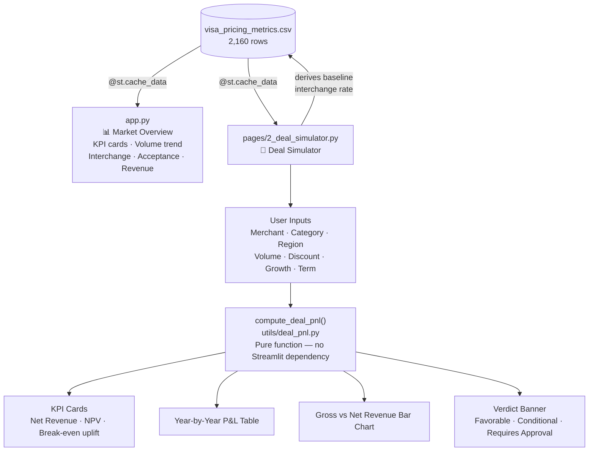

# Deal Simulator Implementation Plan

> **For agentic workers:** REQUIRED SUB-SKILL: Use superpowers:subagent-driven-development (recommended) or superpowers:executing-plans to implement this plan task-by-task. Steps use checkbox (`- [ ]`) syntax for tracking.

**Goal:** Extend the single-page Streamlit dashboard into a two-page app by adding an interactive merchant deal P&L simulator that demonstrates financial modeling skills aligned to the Visa Pricing Strategy Analyst JD.

**Architecture:** Extract a shared data loader into `utils/data_loader.py` used by both pages. The simulator's core logic lives in `utils/deal_pnl.py` as a pure, testable function with no Streamlit dependency. The deal simulator page wires inputs to the function and renders outputs. Streamlit automatically adds `streamlit_app/` to `sys.path` when running `streamlit run app.py`, so no path manipulation is needed in either page.

**Tech Stack:** Python 3, Streamlit, Pandas, Altair, pytest

---

## Prerequisites

These must be true before starting:

1. Python 3.10+ installed
2. Run from `streamlit_app/` to start the app: `streamlit run app.py`
3. Run from the project root to execute tests: `pytest`
4. All dependencies installed:

```bash
pip install streamlit altair pandas pytest
```

---

## Key formula: Volume Uplift to Break Even

> This is the metric most likely to come up in an interview — understand it before implementing.

If Visa offers a merchant a 15% discount off the standard interchange rate, Visa earns only 85% of what it would at standard pricing. To *break even* relative to a smaller deal at standard rates, the merchant must bring enough additional volume so that the discounted revenue equals what the un-discounted revenue would have been:

```
V_standard × rate = V_discounted × rate × (1 - discount)
V_discounted = V_standard / (1 - discount)
Uplift needed = V_discounted - V_standard = V_standard × discount / (1 - discount)
```

In code: `breakeven_uplift_m = committed_volume_m / (1 - discount_rate) - committed_volume_m`

Example: 50M committed transactions, 15% discount → uplift needed = 50 / 0.85 - 50 = **8.8M additional transactions per year**.

---

## File Map

| File | Action | Responsibility |
|---|---|---|
| `streamlit_app/app.py` | Modify | Import loader from utils; update page config title |
| `streamlit_app/utils/__init__.py` | Create | Makes utils a Python package |
| `streamlit_app/utils/data_loader.py` | Create | Shared cached CSV loader |
| `streamlit_app/utils/deal_pnl.py` | Create | Pure `compute_deal_pnl()` function |
| `streamlit_app/pages/2_deal_simulator.py` | Create | Deal simulator Streamlit page |
| `tests/__init__.py` | Create | Makes tests a package |
| `tests/test_deal_pnl.py` | Create | Unit tests for `compute_deal_pnl` |
| `pytest.ini` | Create | Configure pythonpath so tests use same import style as app |

---

## Task 1: Create utils package and shared data loader

**Files:**
- Create: `streamlit_app/utils/__init__.py`
- Create: `streamlit_app/utils/data_loader.py`
- Modify: `streamlit_app/app.py`

- [ ] **Step 1: Create the utils package**

Create `streamlit_app/utils/__init__.py` as an empty file.

- [ ] **Step 2: Create the shared data loader**

Create `streamlit_app/utils/data_loader.py`:

```python
import streamlit as st
import pandas as pd
from pathlib import Path

DATA_PATH = Path(__file__).parent.parent / "data" / "visa_pricing_metrics.csv"


@st.cache_data
def load_data() -> pd.DataFrame:
    return pd.read_csv(DATA_PATH, parse_dates=["month"])
```

- [ ] **Step 3: Replace the data loading block in app.py**

The top of `streamlit_app/app.py` currently reads:

```python
import streamlit as st
import pandas as pd
import altair as alt
from pathlib import Path

st.set_page_config(
    page_title="Visa Pricing Analytics",
    page_icon="💳",
    layout="wide",
)

DATA_PATH = Path(__file__).parent / "data" / "visa_pricing_metrics.csv"

@st.cache_data
def load_data():
    df = pd.read_csv(DATA_PATH, parse_dates=["month"])
    return df

df = load_data()
```

Replace the entire block above with:

```python
import streamlit as st
import pandas as pd
import altair as alt
from utils.data_loader import load_data

st.set_page_config(
    page_title="Market Overview",
    page_icon="💳",
    layout="wide",
)

df = load_data()
```

Note: No `sys.path` manipulation needed. Streamlit automatically adds `streamlit_app/` to `sys.path` for all pages when you run `streamlit run app.py` from that directory.

- [ ] **Step 4: Verify app still loads**

Run from `streamlit_app/`:
```bash
streamlit run app.py
```

Expected: App loads at `http://localhost:8501`. All four charts visible. Terminal shows no import errors.

- [ ] **Step 5: Commit**

```bash
git add streamlit_app/utils/__init__.py streamlit_app/utils/data_loader.py streamlit_app/app.py
git commit -m "refactor: extract shared data loader into utils package"
```

---

## Task 2: TDD — implement compute_deal_pnl

**Files:**
- Create: `pytest.ini`
- Create: `tests/__init__.py`
- Create: `tests/test_deal_pnl.py`
- Create: `streamlit_app/utils/deal_pnl.py`

- [ ] **Step 1: Create pytest configuration**

Create `pytest.ini` at the project root:

```ini
[pytest]
pythonpath = streamlit_app
testpaths = tests
```

This adds `streamlit_app/` to the Python path for tests, so test imports (`from utils.deal_pnl import ...`) match app imports exactly — no inconsistent import paths between test and production code.

- [ ] **Step 2: Write failing tests**

Create `tests/__init__.py` (empty), then create `tests/test_deal_pnl.py`:

```python
import pytest
from utils.deal_pnl import compute_deal_pnl


def test_returns_one_row_per_year():
    df = compute_deal_pnl(
        baseline_interchange_rate=0.019,
        committed_volume_m=50.0,
        avg_transaction_usd=85.0,
        discount_rate=0.10,
        deal_term_years=3,
        volume_growth_rate=0.05,
    )
    assert len(df) == 3


def test_year_1_volume_equals_committed_volume():
    df = compute_deal_pnl(
        baseline_interchange_rate=0.019,
        committed_volume_m=50.0,
        avg_transaction_usd=85.0,
        discount_rate=0.10,
        deal_term_years=3,
        volume_growth_rate=0.05,
    )
    assert df.loc[0, "volume_m"] == pytest.approx(50.0)


def test_year_2_volume_reflects_growth_rate():
    # 50M * 1.10^1 = 55M
    df = compute_deal_pnl(
        baseline_interchange_rate=0.019,
        committed_volume_m=50.0,
        avg_transaction_usd=85.0,
        discount_rate=0.10,
        deal_term_years=3,
        volume_growth_rate=0.10,
    )
    assert df.loc[1, "volume_m"] == pytest.approx(55.0)


def test_gross_revenue_is_volume_times_avg_txn_times_rate():
    # 10M txns * $100 * 2.0% = $20,000,000
    df = compute_deal_pnl(
        baseline_interchange_rate=0.020,
        committed_volume_m=10.0,
        avg_transaction_usd=100.0,
        discount_rate=0.0,
        deal_term_years=1,
        volume_growth_rate=0.0,
    )
    assert df.loc[0, "gross_revenue"] == pytest.approx(20_000_000.0)


def test_zero_discount_means_gross_equals_net():
    df = compute_deal_pnl(
        baseline_interchange_rate=0.019,
        committed_volume_m=50.0,
        avg_transaction_usd=85.0,
        discount_rate=0.0,
        deal_term_years=3,
        volume_growth_rate=0.05,
    )
    for _, row in df.iterrows():
        assert row["gross_revenue"] == pytest.approx(row["net_revenue"])


def test_discount_cost_equals_gross_minus_net():
    df = compute_deal_pnl(
        baseline_interchange_rate=0.019,
        committed_volume_m=50.0,
        avg_transaction_usd=85.0,
        discount_rate=0.15,
        deal_term_years=3,
        volume_growth_rate=0.05,
    )
    for _, row in df.iterrows():
        assert row["discount_cost"] == pytest.approx(row["gross_revenue"] - row["net_revenue"])


def test_npv_contribution_uses_hurdle_rate():
    # 10M txns * $100 * 2% = $20M net (no discount). Year 1 NPV = 20M / 1.08
    df = compute_deal_pnl(
        baseline_interchange_rate=0.020,
        committed_volume_m=10.0,
        avg_transaction_usd=100.0,
        discount_rate=0.0,
        deal_term_years=2,
        volume_growth_rate=0.0,
        npv_discount_rate=0.08,
    )
    assert df.loc[0, "npv_contribution"] == pytest.approx(20_000_000.0 / 1.08)


def test_zero_growth_produces_identical_volume_each_year():
    df = compute_deal_pnl(
        baseline_interchange_rate=0.019,
        committed_volume_m=50.0,
        avg_transaction_usd=85.0,
        discount_rate=0.10,
        deal_term_years=4,
        volume_growth_rate=0.0,
    )
    assert df["volume_m"].nunique() == 1
```

- [ ] **Step 3: Run tests to confirm they fail**

Run from the project root:
```bash
pytest tests/test_deal_pnl.py -v
```

Expected: All 8 tests fail with:
```
ModuleNotFoundError: No module named 'utils.deal_pnl'
```

- [ ] **Step 4: Implement compute_deal_pnl**

Create `streamlit_app/utils/deal_pnl.py`:

```python
import pandas as pd


def compute_deal_pnl(
    baseline_interchange_rate: float,
    committed_volume_m: float,
    avg_transaction_usd: float,
    discount_rate: float,
    deal_term_years: int,
    volume_growth_rate: float,
    npv_discount_rate: float = 0.08,
) -> pd.DataFrame:
    """
    Compute year-by-year P&L for a merchant acceptance deal.

    Args:
        baseline_interchange_rate: Standard interchange rate (e.g., 0.0195 = 1.95%)
        committed_volume_m: Committed annual transaction volume in millions
        avg_transaction_usd: Average transaction value in USD
        discount_rate: Discount off standard interchange (e.g., 0.10 = 10% off)
        deal_term_years: Length of deal in years (1-5)
        volume_growth_rate: Expected YoY volume growth (e.g., 0.05 = 5%)
        npv_discount_rate: Hurdle rate for NPV calculation (default 8%)

    Returns:
        DataFrame with columns: year, volume_m, gross_revenue, discount_cost,
        net_revenue, npv_contribution
    """
    rows = []
    for year in range(1, deal_term_years + 1):
        volume = committed_volume_m * 1_000_000 * (1 + volume_growth_rate) ** (year - 1)
        gross_revenue = volume * avg_transaction_usd * baseline_interchange_rate
        discount_cost = gross_revenue * discount_rate
        net_revenue = gross_revenue - discount_cost
        npv_contribution = net_revenue / (1 + npv_discount_rate) ** year
        rows.append({
            "year": year,
            "volume_m": volume / 1_000_000,
            "gross_revenue": gross_revenue,
            "discount_cost": discount_cost,
            "net_revenue": net_revenue,
            "npv_contribution": npv_contribution,
        })
    return pd.DataFrame(rows)
```

- [ ] **Step 5: Run tests to confirm they pass**

Run: `pytest tests/test_deal_pnl.py -v`

Expected:
```
PASSED tests/test_deal_pnl.py::test_returns_one_row_per_year
PASSED tests/test_deal_pnl.py::test_year_1_volume_equals_committed_volume
PASSED tests/test_deal_pnl.py::test_year_2_volume_reflects_growth_rate
PASSED tests/test_deal_pnl.py::test_gross_revenue_is_volume_times_avg_txn_times_rate
PASSED tests/test_deal_pnl.py::test_zero_discount_means_gross_equals_net
PASSED tests/test_deal_pnl.py::test_discount_cost_equals_gross_minus_net
PASSED tests/test_deal_pnl.py::test_npv_contribution_uses_hurdle_rate
PASSED tests/test_deal_pnl.py::test_zero_growth_produces_identical_volume_each_year
8 passed in 0.XXs
```

- [ ] **Step 6: Commit**

```bash
git add pytest.ini tests/__init__.py tests/test_deal_pnl.py streamlit_app/utils/deal_pnl.py
git commit -m "feat: add compute_deal_pnl with full test coverage"
```

---

## Task 3: Build the deal simulator page and add documentation

**Files:**
- Create: `streamlit_app/pages/2_deal_simulator.py`
- Create: `docs/pipeline-diagram.md`

- [ ] **Step 1: Create the pages directory**

```bash
mkdir -p streamlit_app/pages
```

- [ ] **Step 2: Create the simulator page**

Create `streamlit_app/pages/2_deal_simulator.py`:

```python
import streamlit as st
import pandas as pd
import altair as alt
from utils.data_loader import load_data
from utils.deal_pnl import compute_deal_pnl

st.set_page_config(page_title="Deal Simulator", page_icon="🤝", layout="wide")

st.title("Deal Simulator")
st.caption(
    "Model the P&L of a merchant acceptance deal. "
    "Baseline interchange rates are derived from historical data."
)

df = load_data()

left, right = st.columns([1, 2])

with left:
    st.subheader("Deal Inputs")
    merchant_name = st.text_input("Merchant Name", value="Acme Retail Co.")
    category = st.selectbox("Merchant Category", sorted(df["merchant_category"].unique()))
    region = st.selectbox("Region", sorted(df["region"].unique()))
    deal_term = st.slider("Deal Term (years)", min_value=1, max_value=5, value=3)
    committed_volume_m = st.number_input(
        "Committed Annual Volume (M transactions)",
        min_value=1.0,
        max_value=500.0,
        value=50.0,
        step=1.0,
    )
    discount_pct = st.slider("Discount Rate off Standard Interchange (%)", 0, 30, 10)
    growth_pct = st.slider("Expected Volume Growth Rate (% YoY)", 0, 20, 5)

segment_mask = (df["merchant_category"] == category) & (df["region"] == region)
segment_df = df[segment_mask] if segment_mask.any() else df
baseline_rate = segment_df["interchange_rate"].mean()
avg_txn_usd = segment_df["avg_transaction_usd"].mean()

discount_rate = discount_pct / 100
growth_rate = growth_pct / 100

pnl_df = compute_deal_pnl(
    baseline_interchange_rate=baseline_rate,
    committed_volume_m=committed_volume_m,
    avg_transaction_usd=avg_txn_usd,
    discount_rate=discount_rate,
    deal_term_years=deal_term,
    volume_growth_rate=growth_rate,
)

total_net_revenue = pnl_df["net_revenue"].sum()
deal_npv = pnl_df["npv_contribution"].sum()

# Volume uplift needed so that discounted revenue = un-discounted revenue at committed volume.
# Derivation: V_committed x rate = V_needed x rate x (1 - discount)
#             V_needed = V_committed / (1 - discount)
#             Uplift   = V_needed - V_committed
breakeven_uplift_m = (
    committed_volume_m / (1 - discount_rate) - committed_volume_m
    if discount_rate < 1
    else float("inf")
)

with right:
    st.subheader(f"Deal Output: {merchant_name}")

    if discount_pct <= 10:
        st.success("Favorable — within standard pricing band")
    elif discount_pct <= 20:
        st.warning("Conditional — requires volume commitment verification")
    else:
        st.error("Requires senior approval — above standard discount threshold")

    k1, k2, k3 = st.columns(3)
    k1.metric("Total Net Revenue", f"${total_net_revenue / 1_000_000:.1f}M")
    k2.metric("Deal NPV (8% hurdle)", f"${deal_npv / 1_000_000:.1f}M")
    k3.metric(
        "Volume Uplift to Break Even",
        f"{breakeven_uplift_m:.1f}M txns/yr",
        help=(
            "Additional annual volume the merchant must bring to offset this discount. "
            "Formula: committed_volume / (1 - discount_rate) - committed_volume"
        ),
    )

    st.divider()

    chart_data = pnl_df[["year", "gross_revenue", "net_revenue"]].melt(
        id_vars="year", var_name="type", value_name="revenue"
    )
    chart_data["revenue_m"] = chart_data["revenue"] / 1_000_000
    chart_data["type"] = chart_data["type"].map(
        {"gross_revenue": "Gross Revenue", "net_revenue": "Net Revenue"}
    )

    bar_chart = (
        alt.Chart(chart_data)
        .mark_bar()
        .encode(
            x=alt.X("year:O", title="Year"),
            y=alt.Y("revenue_m:Q", title="Revenue (USD M)"),
            color=alt.Color("type:N", title=""),
            xOffset="type:N",
            tooltip=[
                alt.Tooltip("year:O", title="Year"),
                alt.Tooltip("type:N", title="Type"),
                alt.Tooltip("revenue_m:Q", title="Revenue ($M)", format=".2f"),
            ],
        )
        .properties(height=280)
    )
    st.altair_chart(bar_chart, use_container_width=True)

    st.subheader("Year-by-Year P&L")
    display_df = pd.DataFrame({
        "Year": pnl_df["year"],
        "Volume (M txns)": pnl_df["volume_m"].map("{:.1f}".format),
        "Gross Revenue": pnl_df["gross_revenue"].map("${:,.0f}".format),
        "Discount Cost": pnl_df["discount_cost"].map("${:,.0f}".format),
        "Net Revenue": pnl_df["net_revenue"].map("${:,.0f}".format),
        "NPV Contribution": pnl_df["npv_contribution"].map("${:,.0f}".format),
    })
    st.dataframe(display_df, use_container_width=True, hide_index=True)

    st.caption(
        f"Baseline interchange rate for {category} / {region}: "
        f"{baseline_rate * 100:.3f}% | Avg transaction: ${avg_txn_usd:.2f}"
    )
```

- [ ] **Step 3: Create pipeline diagram**

Create `docs/pipeline-diagram.md`:

```markdown
# Pipeline Diagram


```

- [ ] **Step 4: Verify the two-page app**

Run from `streamlit_app/`:
```bash
streamlit run app.py
```

**Recruiter test** — what a hiring manager should see in 2 minutes:
- Sidebar shows two pages: "App" (Market Overview) and "2 deal simulator" (Streamlit derives display names from filenames — underscores become spaces, leading numbers become a prefix)
- Market Overview: all four charts load, sidebar filters respond
- Deal Simulator: type a merchant name → header updates. Move discount slider to 25% → banner turns red. Move back to 8% → turns green. KPI cards and bar chart update instantly

**Technical interviewer test** — verify the math manually:
- Set: category=Retail, region=North America, volume=10M, discount=0%, growth=0%, term=1 year
- Gross Revenue = Net Revenue = `10M × avg_txn_usd × baseline_rate` (exact values shown in caption)
- NPV Contribution ≈ Net Revenue ÷ 1.08 (year 1 at 8% hurdle)
- Volume Uplift to Break Even = 0.0M (confirmed: formula gives 10 / 1.0 - 10 = 0)
- Now set discount=15% → Uplift should be approximately `10M / 0.85 - 10M = 1.76M`

- [ ] **Step 5: Commit**

```bash
git add streamlit_app/pages/2_deal_simulator.py docs/pipeline-diagram.md
git commit -m "feat: add deal simulator page and pipeline diagram"
```

---

## JD Coverage Checklist

Before calling this done, verify each JD requirement is visibly demonstrated:

| JD requirement | Where it shows up |
|---|---|
| "Develop pricing and deal constructs for acceptance agreements with merchants" | Deal Simulator — full merchant P&L from inputs to verdict |
| "Business case development" | Year-by-year P&L table + Deal NPV KPI card |
| "Superior analytical, financial modeling skills" | NPV at 8% hurdle, break-even uplift formula, compounding volume growth |
| "Quickly arrive at recommendations" | Verdict banner gives immediate green/amber/red signal |
| "Synthesizing large data sets" | Baseline interchange rate derived from 2,160-row dataset, shown in caption |
| "Stakeholder impact assessments" | Discount bands tied to approval thresholds (<=10% / <=20% / >20%) |
