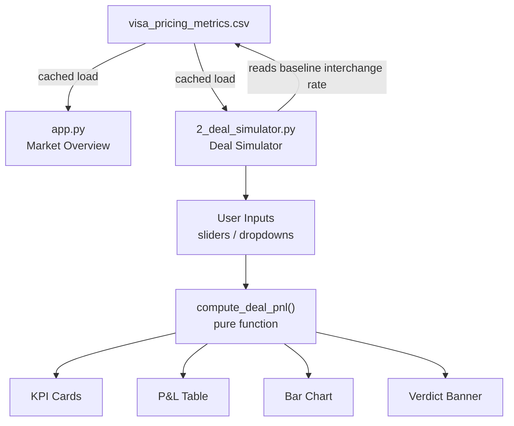

# Design: Two-Page Streamlit App with Deal Simulator

**Date:** 2026-04-09
**Project:** Visa Pricing Analyst
**Role target:** Analyst, Pricing Strategy — Visa Inc.

---

## Goal

Extend the existing single-page Streamlit dashboard into a two-page app. Page 1 retains the existing market overview charts. Page 2 adds an interactive deal P&L simulator that demonstrates financial modeling skills directly relevant to the JD's focus on *"client deal pricing and strategy"* and *"pricing frameworks and tools to support our most strategic deals."*

---

## Structure & Navigation

Streamlit native multipage convention using a `pages/` folder. All filenames are lowercase snake_case.

```
streamlit_app/
├── app.py                        ← Page 1: Market Overview (existing dashboard)
├── pages/
│   └── 2_deal_simulator.py       ← Page 2: Deal Simulator (new)
├── data/
│   └── visa_pricing_metrics.csv
└── generate_data.py
```

Streamlit auto-generates sidebar navigation. Page titles are set via `st.set_page_config`.

---

## Page 1: Market Overview (no changes)

Existing charts remain as-is:
- 4 KPI cards (total transactions, revenue, avg interchange rate, avg acceptance rate)
- Transaction volume over time (line chart)
- Interchange rate by merchant category (bar chart)
- Acceptance rate by region (bar chart)
- Revenue by card type (bar chart)
- Sidebar filters: region, merchant category, card type, date range

---

## Page 2: Deal Simulator

### Layout

Two columns: inputs on the left, outputs on the right.

### Inputs (left column)

| Input | Type | Range / Options |
|---|---|---|
| Merchant name | Text input | Free text, used in output labels |
| Merchant category | Dropdown | Retail, Travel, Dining, Healthcare, E-commerce, Fuel |
| Region | Dropdown | 5 regions matching dataset |
| Deal term | Slider | 1–5 years |
| Committed annual volume (M transactions) | Number input | 1–500M |
| Discount rate off standard interchange | Slider | 0–30% |
| Expected volume growth rate (YoY) | Slider | 0–20% |

The **baseline interchange rate** is derived from the CSV average for the selected category + region combination — grounding the simulator in the existing dataset.

### Computation

A pure function `compute_deal_pnl()` takes all inputs and returns a DataFrame with one row per year:

```
year | volume | gross_revenue | discount_cost | net_revenue | npv_contribution
```

NPV is calculated at a fixed 8% discount rate — a standard corporate hurdle rate.

### Outputs (right column)

1. **KPI cards** — Total net revenue, break-even volume, deal NPV
2. **Year-by-year P&L table** — gross revenue, discount cost, net revenue per year
3. **Bar chart** — gross vs net revenue side-by-side per year (Altair)
4. **Verdict banner** — green "Deal is profitable" / amber "Marginal" / red "Deal is loss-making" based on NPV sign and margin

---

## Data Flow



Both pages load the CSV independently via the same `@st.cache_data` loader. No shared session state between pages. The simulator is stateless: inputs in, P&L DataFrame out.

---

## What this demonstrates (mapped to JD)

| JD requirement | Dashboard feature |
|---|---|
| "Develop pricing and deal constructs for acceptance agreements with merchants" | Deal simulator models a merchant acceptance deal end-to-end |
| "Business case development" | Year-by-year P&L table + NPV |
| "Superior analytical, financial modeling skills" | NPV computation, break-even analysis, growth projection |
| "Quickly arrive at recommendations" | Verdict banner gives an immediate go/no-go signal |
| "Synthesizing large data sets" | Baseline interchange rate derived from 2,160-row dataset |

---

## Out of scope (this iteration)

- Opportunity Map page (Approach 3) — deferred for future iteration
- Real API data — synthesized CSV only
- User authentication or data persistence
